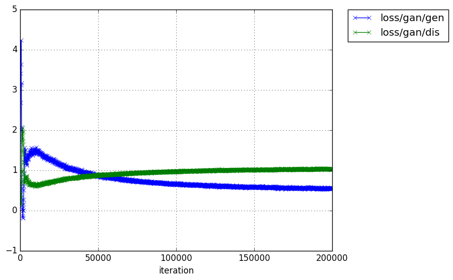
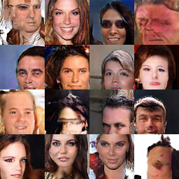

# DRAGAN
A Chainer implementation of [How to Train Your DRAGAN](https://arxiv.org/abs/1705.07215).

# Usage
## DRAGAN with MNIST(with GPU #n)
```
python dragan_mnist.py -g n
```

## DRAGAN with MNIST(without GPU)
```
python dragan_mnist.py
```

## DRAGAN with CelebA(with GPU #n)
```
python dragan_mnist.py -g n
```

## DRAGAN with CelebA(without GPU)
```
python dragan_mnist.py
```

# Result
## gan loss


## generated images

